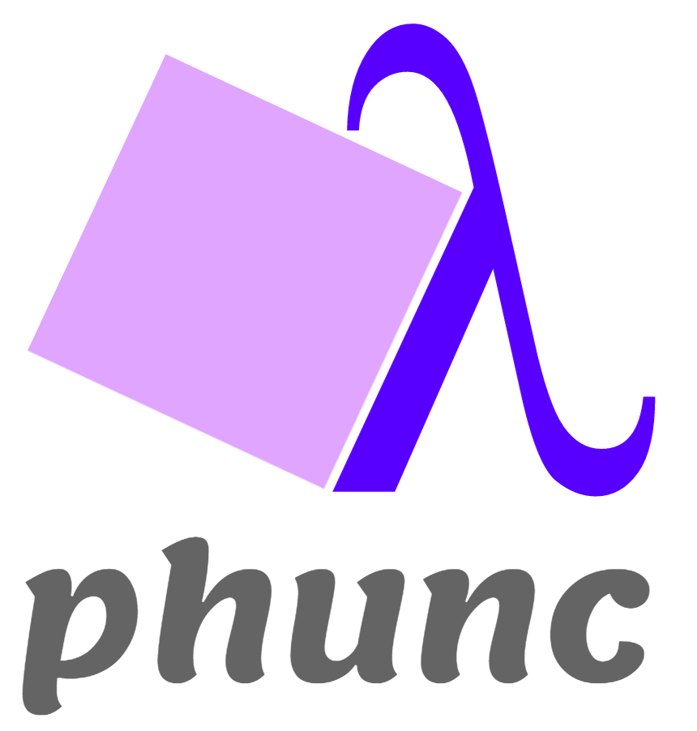
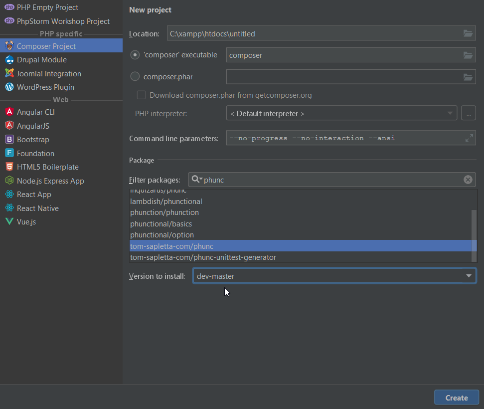

[Phunc, functional programming in PHP with strong typing](https://github.com/phunc-org/Phunc)
=====

## The strongest side of PHP
With this libraries you are able to use benefits with strong typing in PHP 5 & 7

+ Collections with Data Models as Objects
+ Units as Objects with Conversion between Units
+ Calculator with all operations as Objects

[Apache2 requests](doc/Apache2.md)

## introduction

With Phunc library I share ideas practice software examples.
"how to use simple functional PHP with usage objecting representation"
utilities for functional programming.

## Phunctional thinking

If you are not happy with functions in PHP to implements functional programming, try to use objects.
PHP objects can help with: 

+ define
+ transport
+ conversion
+ controlling

## Example functional programming with strong typing

### Example PHP CLASS
```
class Dump
{    
    public function __construct(ArrayObject $array)
    {
        // first variable
        try {
                if(empty($array->first)){
                    throw new Exception('Undefined property: first'); 
                }
                var_dump($array->first);
                
                
        } catch( Exception $e ) {
           echo 'Problem with ' . $e->getMessage() . "\n";
        }
         
        // second variable
        try {
            if(empty($array->second))
            {
                throw new Exception('Undefined property: second'); 
            }
            var_dump($array->second);
            
        } catch( Exception $e ) {
           echo 'Problem with ' . $e->getMessage() . "\n";
        }
    }
}
```

### 1. Example without parameters

#### Code
```
$a = new ArrayObject();
new Dump( $a );
```

#### Result
```
Problem with Undefined property: first
Problem with Undefined property: second
```

### 2. Example with first parameter

#### Code
```
$a = new ArrayObject();
$a->first = 1;
new Dump( $a );
```

#### Result
```
int(1)
Problem with Undefined property: second
```

### 3. Example with both parameters

#### Code
```
$a = new ArrayObject();
$a->first = 1;
$a->second = 2;
new Dump( $a );
```

#### Result
```
int(1)
int(2)
```




[packagist phunc](https://packagist.org/packages/tom-sapletta-com/phunc)

## Install in PHPstorm based on composer project



## Easy way to install Phunc with APICRA

### first install apicra: 

### install Phunc over apicra 
    
    dot phunc install


## Install Phunc

Add the phunc library to your applications composer.json file:
```
composer require tom-sapletta-com/phunc
```

```
{
    "require": {
        "tom-sapletta-com/phunc": "*"
    }
}
```

### Install Composer

Now tell composer to download the library by running the following command:

#### Linux
```
curl -sS https://getcomposer.org/installer | php
mv composer.phar /usr/local/bin/composer
```

#### Windows
``` bash
php -r "copy('https://getcomposer.org/installer', 'composer-setup.php');"
php -r "if (hash_file('SHA384', 'composer-setup.php') === 'e115a8dc7871f15d853148a7fbac7da27d6c0030b848d9b3dc09e2a0388afed865e6a3d6b3c0fad45c48e2b5fc1196ae') { echo 'Installer verified'; } else { echo 'Installer corrupt'; unlink('composer-setup.php'); } echo PHP_EOL;"
php composer-setup.php
php -r "unlink('composer-setup.php');"
```

Composer will install the bundle into your project's `vendor/tom-sapletta-com/phunc` directory.

### How to start?

Add the config classes in new folder `config/`

```
InfoPath.php
ErrorPath.php
```
Add the temporary folder `tmp/`


#### Creating example class ErrorPath
```
namespace Config;

class ErrorPath
{
    function __toString()
    {
        return '../tmp/error.log.txt';
    }
}
```
#### using example class ErrorPath
```
(string) new ErrorPath();
```

## Todo List

see Todo List [here](TODO.md)


## Contributors

Thanks goes to these wonderful people ([emoji key][emojis]):

<!-- ALL-CONTRIBUTORS-LIST:START - Do not remove or modify this section -->
<!-- prettier-ignore -->
| [<br /><sub><b>Kent C. Dodds</b></sub>](https://kentcdodds.com)<br />[💬](#question-kentcdodds "Answering Questions") [📖](https://github.com/kentcdodds/all-contributors/commits?author=kentcdodds "Documentation") [👀](#review-kentcdodds "Reviewed Pull Requests") [📢](#talk-kentcdodds "Talks") |
<!-- ALL-CONTRIBUTORS-LIST:END -->

This project follows the [all-contributors][all-contributors] specification.
Contributions of any kind are welcome!

## LICENSE

[MIT](LICENSE)
