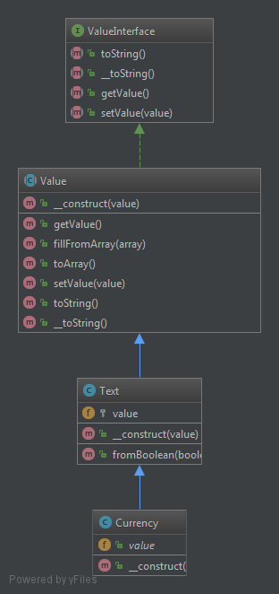
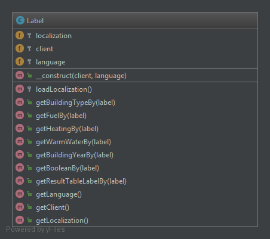
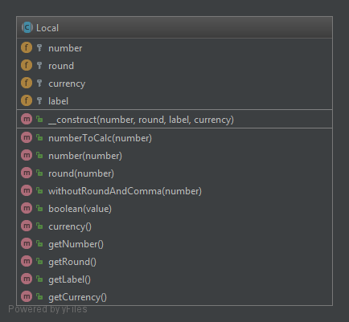
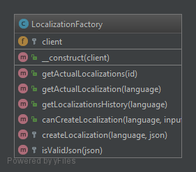
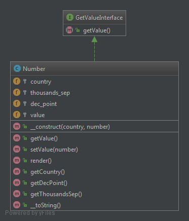
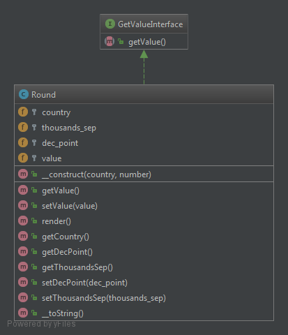
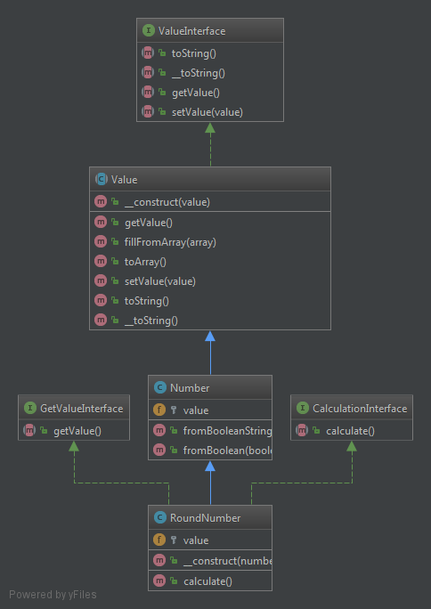

# Localisation Documentation

## Diagramm

### Local > Currency

### Local > Label

### Local > Local

### Local > Localization

### Local > LocalizationFactory

### Local > Number

### Local > Round

### Local > RoundNumber
